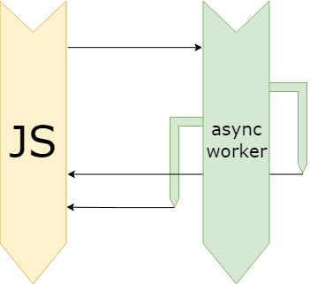

[](https://github.com/shilangyu/async-worker/actions)
[](https://david-dm.org/shilangyu/async-worker)
[](https://snyk.io/test/github/shilangyu/async-worker?targetFile=package.json)
[](https://github.com/shilangyu/async-worker/issues)
[](https://opensource.org/licenses/mit-license.php)

<p align="center">
	
</p>

<p align="center">
✨ Enhance your asynchronous web development by sprinkling parallel code execution! ✨
</p>

- [installing](#installing)
- [API](#api)
	- [task](#task)
	- [cook](#cook)
	- [track](#track)
	- [kill](#kill)
- [common mistakes](#common-mistakes)

[EXAMPLES](https://shilangyu.github.io/async-worker/)

### installing

Install from npm:

```sh
npm i async-worker
```

Import:

```ts
import AsyncWorker from 'async-worker'
```

Alternatively use the embeded script tag (`AsyncWorker` will be available globally):

```html
<script src="https://cdn.jsdelivr.net/npm/async-worker/dist/async-worker.web.js"></script>
```

### API

#### task

To perform a long, expensive tasks outside of the main thread use `asyncWorker.task`

```ts
const { task } = new AsyncWorker()

const primes = await task(
	(from, to) => {
		let computedPrimes = []
		// im computing big data that would otherwise block the main thread
		return computedPrimes
	},
	10,
	1000000
)
```

```ts
function task<T, S extends any[]>(func: (...args: S) => T, ...args: S): Promise<T>
```

#### cook

To cook a function into an asynchronous one use `asyncWorker.cook`

```ts
const { cook } = new AsyncWorker()

const asyncFibo = cook(() => n => {
	if (n <= 0) return NaN

	let [first, second] = [0, 1]
	while (--n) [first, second] = [second, first + second]

	return first
})

const res = await asyncFibo(5)
console.log(`5th fibonnaci number is ${res}`)
```

```ts
function cook<T, S extends any[], U extends any[]>(
	func: (...args: S) => (...args: U) => T,
	...args: S
): (...args: U) => Promise<T>
```

#### track

To track progress of a task use `asyncWorker.track`

```ts
const { track } = new AsyncWorker()

const tracker = track((tick, n) => {
	let fact = 1
	for (let i = 1; i <= n; i++) {
		fact *= i
		tick(i / n)
	}
	return fact
}, 15)

tracker.tick(progress => console.log(`the factorial is ${progress * 100}% done!`))

console.log(`the result is ${await tracker.result}`)
```

```ts
function track<T, S extends any[]>(
	func: (tick: (progress: number) => void, ...args: S) => T,
	...args: S
): {
	result: Promise<T>
	tick: (ticker: (progress: number) => void) => void
}
```

#### kill

Once you're done using, you can kill it

```ts
const async = new AsyncWorker()

async.task(/* doing something */)

async.kill()
```

### common mistakes

Because web workers exist in a different thread the passed function does not have access to your current context variables. To pass in variables please add them as additional parameters and accept them in your functions. This will **not** work:

```ts
//...
const from = 10
const to = 1000000
const primes = await task(() => {
	console.log(from) // error during worker runtime: 'from' is not defined
	console.log(to) // error during worker runtime: 'to' is not defined
})
//...
```

Do instead:

```ts
//...
const from = 10
const to = 1000000
const primes = await task(
	(from, to) => {
		console.log(from) // :)
		console.log(to) // :)
	},
	from,
	to
)
//...
```

Some types are not [transferable](https://developer.mozilla.org/en-US/docs/Web/API/Transferable). Meaning you cannot send them to or recieve from a web worker. Notably functions are not transferable. The following will **not** work:

```ts
//...
const answer = () => 42
const result = await task(answer => {
	// DataCloneError: could not clone '() => 42'
}, answer)
//...
```

Nor will:

```ts
//...
const func = await task(() => {
	return () => 42
	// DataCloneError: could not clone '() => 42'
})
//...
```
